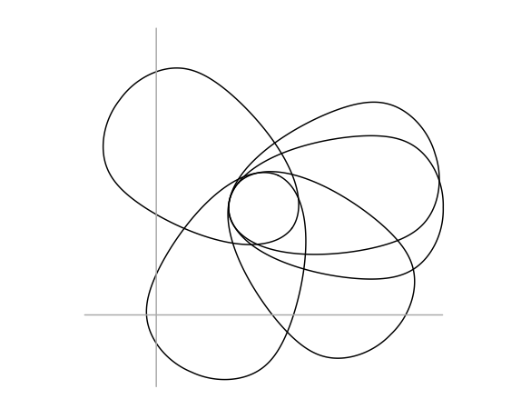
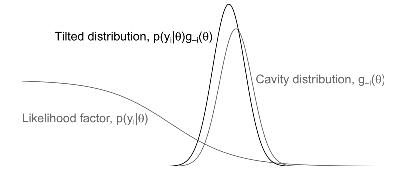
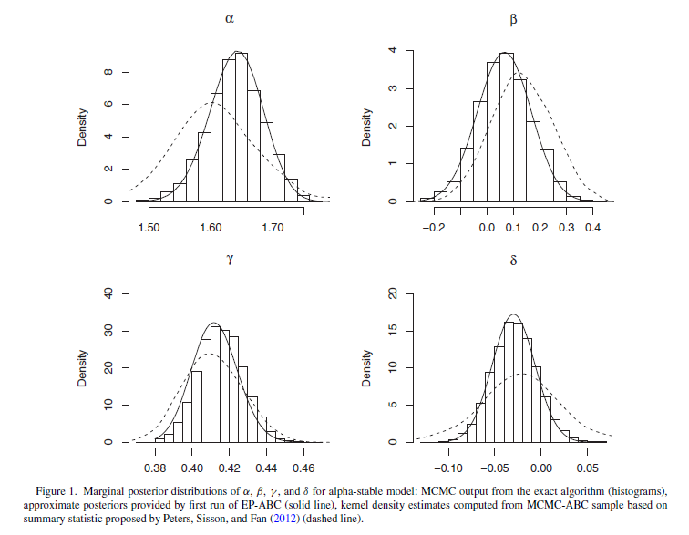

# Background

## Background

- Expectation Propagation (EP) is an algorithm for *variational inference*,
  i.e. estimation of approximate posterior distribution
- Based on paper Simon Barthelmé & Nicolas Chopin (2014)
  *Expectation Propagation for Likelihood-Free Inference*,
  Journal of the American Statistical Association, 109:505, 315-333,
  DOI: 10.1080/01621459.2013.864178

## Setting

- Assume posterior in Bayesian inference can be written as
$$
p(\theta | y_{1:N}) \propto p(\theta)
  \prod_{i = 1}^N p(y_i | y_{1:i - 1}, \theta)
$$
- In ABC, we determine
$$
p(\theta | y_{1:N}) \propto p(\theta) \prod_{i = 1}^N \int
p(\hat{y}_i | y_{1:i - 1}, \theta)
\mathds{1}_{\left\{\|s_i(\hat{y}_i) - s_i(y_i)\| \leq \varepsilon\right\}}
\mathrm{d}\hat{y}_i
$$
  where we assume that we can simulate from $p(\hat{y}_i | y_{1:i - 1}, \theta)$.
  However, no analytic form of the likelihood exists (or expensive to evaluate).

## Re-cap: Parametrizations of the normal distribution

- Standard notation with mean $\mu$ and covariance matrix $\Sigma$
$$
  \phi(x) \propto 
  \exp\left(-\frac{1}{2} (x - \mu)^T \Sigma^{-1} (x - \mu)\right)
$$
- Notation in natural parameters: Precision matrix $Q = \Sigma^{-1}$ and precision mean $r = \Sigma^{-1} \mu$
$$
  \phi(x) \propto
  \exp\left(-\frac{1}{2} x^T Q x + r^T x\right)
$$

# Conventional Expectation Propagation

## Conventional Expectation Propagation

- Idea: Approximate likelihood factors by some simpler distributions,
  typically Gaussians. (Originally from [@Minka2001])
- Let here
$$
\pi(\theta) \propto \prod_{i = 0}^N l_i(\theta)
$$
  where e.g. $l_0$ is the prior for $\theta$ and
  $l_i = p(y_i | y_{1:i - 1}, \theta)$ for $i > 0$.
- We then want to approximate $l_i$ by e.g. a Gaussian
$$
f_i(\theta) = \exp\left(-\frac{1}{2} \theta^T Q_i \theta + r_i^T \theta\right)
$$
  where $Q_i$ is the $i$-th precision matrix and $r_i$ is the $i$-th shift.
- Full approximation $q(\theta) \propto \prod_{i = 0}^N f_i(\theta)$ is then
$$
q(x) \propto \exp\left(-\frac{1}{2} \theta^T \left(\sum_{i = 0}^N Q_i\right) \theta
  + \left(\sum_{i = 0}^N r_i\right)^T \theta\right)
$$

## Visual idea

```{=latex}
\begin{figure}
\centering
\begin{tikzpicture}
  \draw[fill=black] (-1.6, 1.7) circle (.08cm) node[anchor=south west] {$\pi$};
  \draw (1.5, 1.4) node {$\mathcal{N}$};
  \draw (-2, -2) to [bend left=20] coordinate[pos=0.1] (A)(2, 2);
  \draw (-2, -2) to [bend left=20] coordinate[pos=0.26] (C)(2, 2);
  \draw[fill=black] (A) circle (.08cm) node[anchor=north west] {$q^0$};

  \uncover<2->{\draw (A) -- coordinate[pos=0.35] (B)(-1.6, 1.7);}
  \uncover<2->{\draw[fill=black] (B) circle (.08cm)
      node[anchor=south east] {$q^0_{/i}$};}

  \uncover<3->{\draw (B) -- (C);}
  \uncover<3->{\draw[fill=black] (C) circle (.08cm)
      node[anchor=north west] {$q^1$};}
\end{tikzpicture}
\end{figure}
```

- $\pi$: Target distribution
- $\mathcal{N}$: Space of normal distributions
- Move towards target distribution, project back onto space of
  normal distributions

\footnotesize Visualisation from
[Simon Barthelmé: The EP algorithm (YouTube)](https://www.youtube.com/watch?v=0tomU1q3AdY)

## Algorithm

Remember
$$
\pi(\theta) \propto \prod_{i = 0}^N l_i(\theta) \quad\text{and}\quad
q(\theta) \propto \prod_{i = 0}^N f_i(\theta)
$$

### Algorithm
1. Cavity distribution: $q_{-i}(\theta) = \prod_{j \neq i} f_j(\theta)$
2. Hybrid/tilted distribution: $q_{/i}(\theta) = q_{-i}(\theta) l_i(\theta)$
3. Find Gaussian approximation to $q_{/i}(\theta)$ which minimizes
   Kullback-Leibler divergence
$$
\mathrm{KL}(q_{/i} || q^{\textrm{new}}) = \int q_{/i}(\theta)
\log\left(\frac{q_{/i}(\theta)}{q^{\textrm{new}}(\theta)}\right)
\mathrm{d}\theta
$$
    In the exponential family, this means determination of a new normal
    approximation by matching the moments of the hybrid distribution.

## One factor at a time. Why?

<div class="columns">
<div class="column" width="40%">

</div>
<div class="column" width="60%">

</div>
</div>

- Cavity acts as a prior for the $i$-th likelihood factor
- Overlap of likelihood factors is explored more efficiently

\footnotesize Figures from [@Gelman2014]

## For Gaussian sites

- We get
$$
q_{/i}(\theta) \propto l_i(\theta) q_{-i}(\theta) \propto
l_i(\theta) \exp\left(-\frac{1}{2}\theta^T Q_{-i} \theta + r_{-i}^T \theta\right)
$$
  where $Q_{-i} = \sum_{j \neq i} Q_j$ and $r_{-i} = \sum_{j \neq i} r_i$.
- Calculate updates
$$
\begin{aligned}
  Z &= \int l_i(\theta) q_{-i}(\theta) \mathrm{d}\theta \\
  \mu &= \frac{1}{Z} \int \theta l_i(\theta) q_{-i}(\theta) \mathrm{d}\theta \\
  \Sigma &= \frac{1}{Z} \int \theta \theta^T l_i(\theta) q_{-i}(\theta)
  \mathrm{d} \theta - \mu \mu^T
\end{aligned}
$$
- New approximation to $l_i(\theta)$ has parameters
$$
Q_i = \Sigma^{-1} - Q_{-i}, \quad r_i = \Sigma^{-1} \mu - r_{-i}
$$

# Adaptation to likelihood free context

## Adaptation to likelihood free context

- We do not have access to the analytical form of the likelihood factors
  $p(\hat{y}_i | y_{1:i-1}, \theta)$
- Integration for moment update not possible analytically
- *Idea:* Sample many
$$
\theta^{(m)} \sim q_{-i}(\theta) = \mathcal{N}(\theta; \mu_{-i}, \Sigma_{-i})
$$
  and sample $\hat{y}_i^{(m)} \sim p(\hat{y}_i | y_{1:i-1}, \theta^{(m)})$ for
  every $\theta^{(m)}$.

## Algorithm

Let $\varepsilon > 0$, $M \in \mathbb{N}$, $\mu_{-i}$ and $\Sigma_{-i}$ be given.

### Sample
1. Sample $\theta^{(m)} \sim \mathcal{N}(\theta; \mu_{-i}, \Sigma_{-i})$ for
   $m = 1, \dots, M$.
2. Sample $\hat{y}_i^{(m)} \sim p(\hat{y}_i | y_{1:i-1}, \theta^{(m)})$ for
   every $\theta^{(m)}$.

### Compute
$$
\begin{aligned}
M_{\mathrm{acc}} &= \sum_{m = 1}^M
  \mathds{1}_{\{\|\hat{y}^{(m)}_i - y_i\| \leq \varepsilon\}} \\
\hat{\mu} &= \frac{1}{M_{\mathrm{acc}}}
  \sum_{m = 1}^M \theta^{(m)}
  \mathds{1}_{\{\|\hat{y}^{(m)}_i - y_i\| \leq \varepsilon\}} \\
\hat{\Sigma} &= \frac{1}{M_{\mathrm{acc}}}
  \sum_{m = 1}^M \theta^{(m)} (\theta^{(m)})^T
  \mathds{1}_{\{\|\hat{y}^{(m)}_i - y_i\| \leq \varepsilon\}} -
  \hat{\mu}\hat{\mu}^T
\end{aligned}
$$

# Problems and Possible Improvements

## Issues

- Multi-modality cannot be captured
- Inversion of covariance matrix is costly and can easily lead to
  numerical problems (see [@Gelman2014]) 
  - $\Sigma$ estimated but $Q = \Sigma^{-1}$ needed for update
- Possibly inefficient ABC scheme, e.g.
    - how many samples?
    - numerical stability?

\raggedleft
\vspace*{-0.8cm}\includegraphics[height=4cm]{figures/multimodal.PNG}

## Possible Improvements

- Enforce minimum number of samples for ABC procedure
- Recycling of already sampled $\theta^{(m)}$ in the case of IID data
  - These can be weighted like
    $$
      w_{i + 1}^{(m)} = \frac{q_{-(i + 1)}(\theta^{(m)})}{q_{-i}(\theta^{(m)})}
        \mathds{1}_{\{\|y^{(m)} - y_{i + 1}\| \leq \varepsilon\}}
    $$
  - Important to monitor the effective sample size
    $$
      \mathrm{ESS} = \frac{\left(\sum_{m = 1}^M w_i^{(m)}\right)}{%
      \sum_{m = 1}^M \left(w_i^{(m)}\right)^2}
    $$
- Quasi-random/low-discrepancy sequences (e.\,g. Halton or Sobol' sequences)
- Damping for improved convergence:
  $$
    q_i^{\mathrm{new}}(\theta) = q_i(\theta)^{1 - \delta}
      \left(\hat{q}_{/i}(\theta)\,/\,q_{-i}(\theta)\right)^\delta
  $$
  where $\hat{q}_{/i}$ is the Gaussian approximation of $q_{/i}$ and
  $\delta \in (0, 1]$.

# Example: Alpha-stable Models

## Alpha-stable Models

- Distributions with characteristic function
$$
  \Phi_X(t) = 
  \begin{cases}
    \exp\left[i \delta t - \gamma^{\alpha} |t|^{\alpha} 
    \left\{1 + i\beta \tan\left(\frac{\pi\alpha}{2}\right) \right.\right. \\
    \left.\left.\quad \times \sgn(t) \left(|\gamma t|^{1 - \alpha} - 1\right)\right\}\right] 
    & \alpha \neq 1 \\
    \exp\left[i \delta t - \gamma t 
    \left\{1 + i \beta \frac{2}{\pi} \sgn(t) \log(\gamma t)\right\}\right] & \alpha = 1
  \end{cases}
$$
  where $0 < \alpha \leq 2$, $-1 < \beta < 1$, $\gamma > 0$ and $\delta$ are parameters.
- Special cases: 
  - $\alpha = 2$ is the normal distribution
  - $\alpha = 1$ is the cauchy distribution
- No closed form density for most $\alpha$ but interesting in e.g. finance and
  cheap to sample from
- Infinite variance for $\alpha < 2$ and infinite mean for $\alpha < 1$
- It was shown: Hard to determine suitable summary statistics [@Peters2012]

## Numerical Results

\centering
{height=7cm}

- $\varepsilon = 0.1$ for EP-ABC and $\varepsilon = 0.03$ for MCMC-ABC


# Conclusions

## Conclusions

### Positive

- Fast and reasonable accurate for unimodal posteriors
- Suitable for distributed computing

### Negative

- Gaussian approximation: Might have difficulties for severely skewed
  posteriors
- Seems to be hard to prove theoretical results

## References

\small
<div id="refs"></div>
